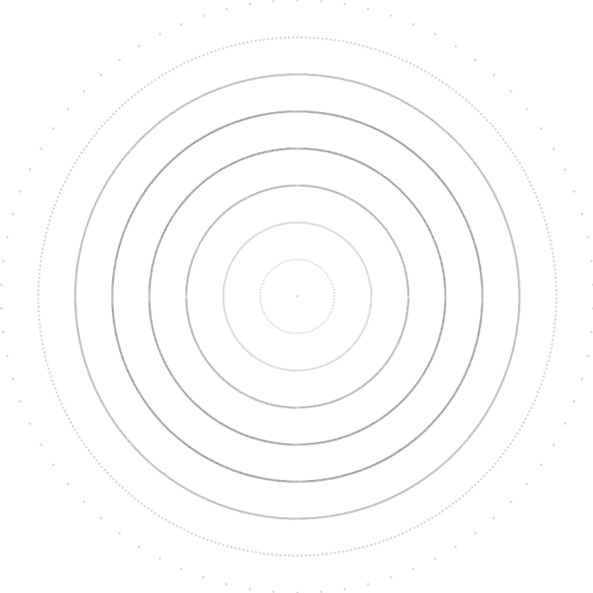
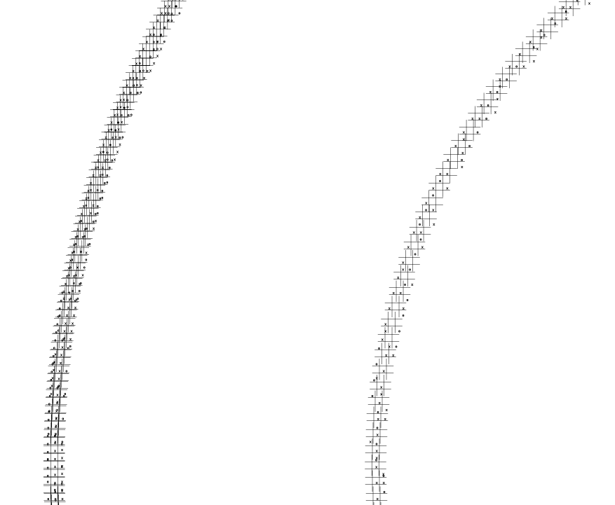

# Tic-Tac-Toe Canvas Experiment

⚠️ **Warning: Work-in-Progress** ⚠️

This project is an attempt to visualize all possible Tic-Tac-Toe states on a scalable canvas using Python and Graphviz. The current layout does not really utilize the output canvas space effectively, and routing "moves" between game states is a core challenge yet to be solved. Expect incomplete functionality and rudimentary visuals.

## Tech Stack

- **Python**: Core logic for generating game states and images.
- **Graphviz**: Used for creating visual representations of the Tic-Tac-Toe game states.

## Project Structure and Code Observations

- **`tictactoe2png.py`**: 
  - Generates PNG visualizations of Tic-Tac-Toe layouts.
  - Primarily responsible for converting game data into PNG format.
  - Minimal error handling and assumes valid game data.
  
- **`tictactoegen.py`**: 
  - Main script to generate Tic-Tac-Toe game state sequences.
  - Logic for determining and storing moves in the game.
  
- **`tictactoe2gv.py`**: 
  - Produces Graphviz-compatible files, facilitating a node-based visualization of game states.
  - The generated Graphviz files visualize game transitions, but routing between moves remains an unresolved issue.
  - The script does not handle dynamic scaling effectively, which limits the clarity of node connections.

## Current Visual State

The following images demonstrate the project's current output:

### 5% Scale View

### 50% Closeup

## Known Issues

- **Layout Complexity**: The current layout implementation is overly simplistic and fails to effectively utilize the output canvas, especially at larger scales.
- **Move Routing**: The logic for routing moves between game states is rudimentary and lacks sophistication, making the output unclear in complex scenarios.
  
---

This is a minimal, experimental project intended for prototyping. Significant work is needed to refine the layout and game state transition logic.

License is MIT. Use as you wish with your own risk etc.